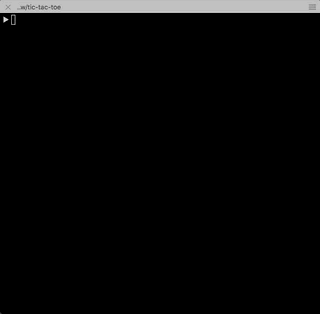
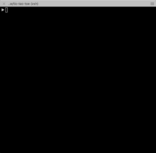

# tic-tac-toe-console

## About the project
This is a fun, simple and highly customizable multiplayer game of tic-tac-toe that I built during one of my sleepless nights. This game is played directly from your console and has lots of customizable features, like the grid size, the game pieces etc. You can also play it in autoplay mode (cpu vs cpu), in offline mode and over a network with a remote player.

## Requirements
- NodeJS
- npm or yarn

## Installation
- clone the repository.
- Install the dependencies using `yarn install` or `npm install`
- Run `node index.js` and enjoy!

## Game play
### Auto play mode (default gameplay)
 

### Auto play mode with customized grid size

### Offline mode with multiplayers with customized game pieces

### Play with remote player over a network
Default port is `1337`

